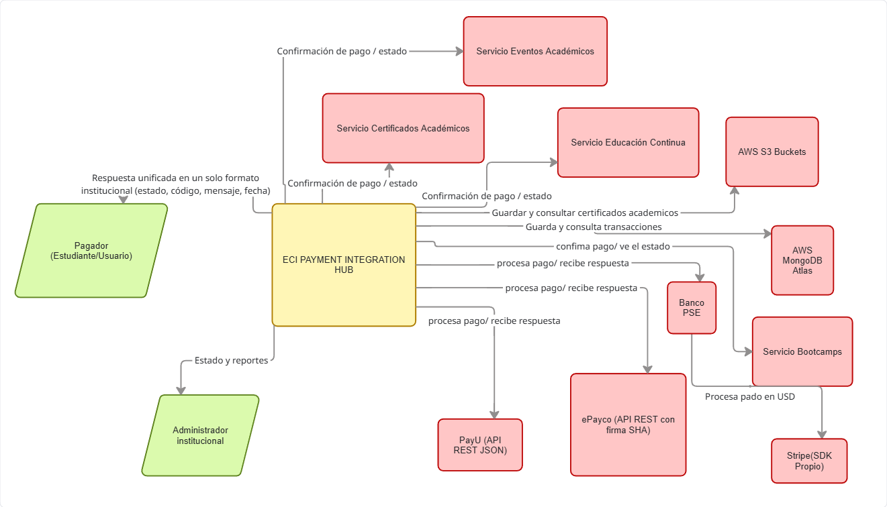
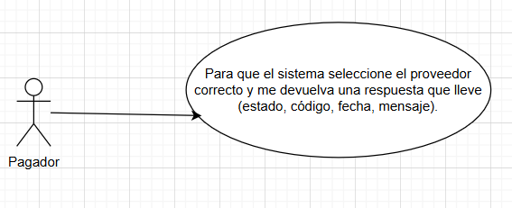
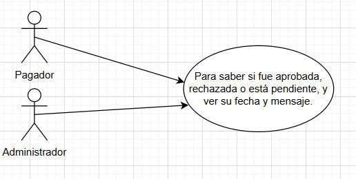

# DOSW_ParcialT1_TomasEspitia
#Parcial 1

**Nombre:** Tomas Espitia
**Grupo:** 2

## Punto 1 - Diagrama de contexto 

---

## Punto 2 - Patrones de diseño
**Patron # 1:**
- **Nombre del Patrón:**  Abstract Factory
- **Tipo de patrón:** Creacional
- **Justificación de la decisión:**  Porque  tenemos
  que poder cambiar entre proveedores
  sin modificar el proceso de pago inicial que llevamos.

**Patron # 2:**
- **Nombre del Patrón:** Adapter
- **Tipo de patrón:** Estructural
- **Justificación de la decisión:** Porque cada proveedor
  que hay nos esta devolviendo informacion
  en distintos tipos.

---

## Punto 3 - Identificar 5 requerimientos

### Funcionales:
### 1.
Registrar Solicitud de pago: El sistema debe permitir registrat una solicitud de pago con nombre, monto, tipo de moneda.
### 2.
Procesar pago seleccionando la correspondiente: El sistema debe permitir procesar la solicitud de pago seleccionadon la correspondiente dependiendo la moneda y el medio de pago que se usara.
### 3.
Condultar el estado en el que esta la transaccion: Se debe poder ver el estado en que va la transaccion usando su codigo y nos debe devolver en que estado esta, la fecha y mensaje que tenga.
### No funcionales:
### 1.
Usar colores que sean institucionales
### 2.
Que haya un tiempo de respuesta predeterminado

---

## Punto 4 - Diagrama casos de uso

### 1.
- Como Pagador
- Quiero consultar el estado en el que esta la transaccion
- Para que el sistema seleccione el proveedor correcto y me devuelva una respuesta que lleve (estado, código, fecha, mensaje)
- En este usamos abstract factory porque se selecciona la familia del proveedor dependiento la moneda y el metodo de pago
- En este usamos adapter porque unificamos las respuestas que nos envian en diferentes formatos conviertiendolos en uno solo

### 2.
- Como Pagador o Administrador
- Quiero consultar el estado de una transacción usando su código
- Para saber si esta aprobada, o la rechazaron, esta pendiente y poder ver la fecha y mensaje

--- 

## Punto 5 - Especificar los 2 requerimientos funcionales

### 1.
- **Procesar pago seleccionando la correspondiente**
- **Descripción:** El sistema debe permitir procesar una solicitud de pago seleccionando 
el proveedor correspondiente dependiendo de la moneda y el medio de pago utilizados, y 
debe devolver una respuesta con: estado, codigo de transacción, mensaje y fecha.
- **Como la vamos a ejecutar:** El pagador ingresa los datos del pago y confirma la operacion. 
El sistema valida las reglas de negocio, selecciona el proveedor adecuado segun moneda y medio 
de pago, procesa la transacción y devuelve la respuesta en formato institucional.
- **Actor principal:** Pagador
- **Precondiciones:** El correo debe ser institucional,
El monto debe ser mayor a 5000 COP, Si la moneda es USD el proveedor permitido es Stripe,
  Si el medio de pago es PSE, el proveedor permitido es BancoPSE,

### Datos de entrada
- | Nombre              | Descripción                 | Tipo de campo  | Reglas / Aplicación           | Obligatorio |
  | ------------------- | --------------------------- | -------------- | ----------------------------- | ----------- |
  | nombrePagador       | Nombre completo del pagador | Texto          | No vacío                      | Sí          |
  | documento           | Documento del pagador       | Texto/Numérico | No vacío                      | Sí          |
  | correoInstitucional | Correo del pagador          | Texto          | Debe ser institucional        | Sí          |
  | conceptoPago        | Concepto del pago           | Texto          | No vacío                      | Sí          |
  | monto               | Valor del pago              | Numérico       | Mayor a 5000 COP              | Sí          |
  | moneda              | Moneda del pago             | Enum           | COP o USD                     | Sí          |
  | medioPago           | Medio de pago               | Enum           | TARJETA / PSE / TRANSFERENCIA | Sí          |
### Datos de salida
- | Nombre            | Descripción                       | Tipo de campo | Reglas / Aplicación              | Obligatorio |
  | ----------------- | --------------------------------- | ------------- | -------------------------------- | ----------- |
  | estado            | Resultado de la transacción       | Enum          | APROBADO / RECHAZADO / PENDIENTE | Sí          |
  | codigoTransaccion | Código único de la transacción    | Texto         | Único                            | Sí          |
  | mensaje           | Mensaje descriptivo del resultado | Texto         | Claro para el usuario            | Sí          |
  | fecha             | Fecha y hora del resultado        | Fecha         | Formato estándar                 | Sí          |

---

## Punto 6 - Requerimiento asociado

**Seleccionamos el requerimiento de procesar pago seleccionando la correspondiente**

- **Epica:** El sistema nos debe permitir procesar pagos utilizando distintos proveedores externos, viendo que el proceso principal no dependa de implementaciones especificas y que las respuestas obtenidas sean entregadas todas en una.
### Tareas tecnicas:
- **Implemntar la estructura** 
Crear interfaz, definir metodos para crear los componentes de integracion.
- **Implementar adapters de cada proveedor**
crear intefaz, implementar el adapter, y traducir las respuestas externas al formato institucional.
- **logica de seleccion** 
Determinar que frabrica usa segun la oneda que este utiliznado y sus metodo de pago, asegurar el cumplimiento de reglaas de negocio
- **Volver las respuestas una sola**
Garantizar que todas las respuestas nos devulvan el estado, mensaje, fecha

---

